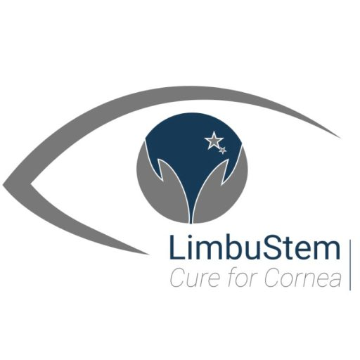

  

# Cornea Donor and Recipient Management System 👁️

Bu proje, kornea bağış süreçlerini (donör ve hasta yönetimi) dijital ortamda takip etmek ve uygun eşleşmeleri yönetmek amacıyla geliştirilmiş bir Java masaüstü uygulamasıdır. 

## 🚀 Öne Çıkan Özellikler
- **Donör Yönetimi:** Donör kayıtlarının oluşturulması ve takibi.
- **Hasta Yönetimi:** Bekleme listesindeki hastaların yönetimi.
- **Eşleştirme Modülü:** Bağışlanan korneaların uygun hastalarla eşleştirilmesi.
- **Veri Ön İşleme:** Python scriptleri ile veri setlerinin temizlenmesi ve düzenlenmesi.

## 🛠️ Kullanılan Teknolojiler
- **Dil:** Java (JDK 17+)
- **Build Aracı:** Maven
- **Veritabanı:** SQLite (Yerel dosya tabanlı)
- **Arayüz:** Java Swing (NetBeans GUI Builder)
- **Yardımcı Araçlar:** Python (Veri temizleme için)

## 📦 Kurulum ve Çalıştırma (Hocalar İçin)
Projenin sorunsuz çalışması için şu adımları izleyebilirsiniz:

1. Bu repository'yi ZIP olarak indirin veya `git clone` ile yerel bilgisayarınıza çekin.
2. **NetBeans IDE**'yi açın.
3. `File > Open Project` menüsünden indirilen klasörü seçin. (Proje bir Maven projesi olduğu için kütüphaneler otomatik yüklenecektir.)
4. Sol taraftaki proje ağacından `MainForm.java` dosyasına sağ tıklayıp **Run File** diyerek uygulamayı başlatabilirsiniz.
5. Veritabanı (`cornea.db`) projenin ana dizininde hazır bulunmaktadır, herhangi bir ek SQL kurulumu gerekmez.

---
*Bu proje Ege Üniversitesi Bilgisayar Mühendisliği kapsamında geliştirilmiştir.*
